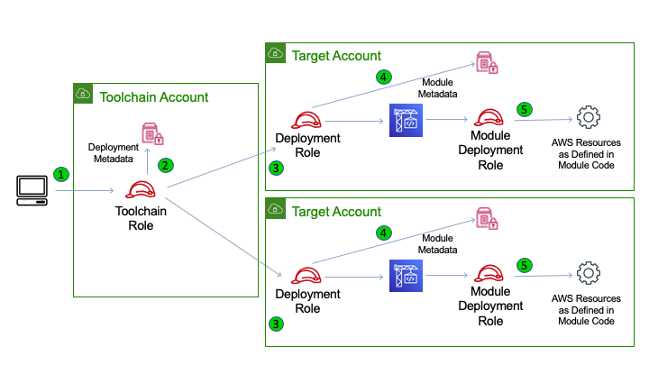

# Architecture

**Seed-Farmer** does not create its own deployments, rather it helps to deploy YOUR modules by acting as the broker between your 
module code and the AWS Cloud via AWS CodeSeeder.


## Multi-Account Architecture
`seedfarmer` leverages IAM roles and assumes the proper role for deployment of modules.  Please see these [account definitons](multiaccount_support) for details related to the role conventions.



1. Invoke **seedfarmer** CLI with role that can assume `toolchain role`
2. **seedfarmer** via `toolchain role` reads/writes deployment metadata with AWS Systems Manager
3. **seedfarmer** `toolchain role` assumes `deployment role` in all `target acccount` to fetch module metadata
4. **seedfarmer** via `deployment role` in `target acccount` initiates module deployment ([see below](method_processing))
5. **seedfarmer** via `deployment role` interacts with S3 for bundle references
6. **seedfarmer** via `deployment role` assumes `module deployment role` to complete module deployment


(method_processing)=
## Method of Processing
Below is a flow of `seedfarmer` deployment of a single module in a single account/region.  Once `seedfarmer` resolves the proper target/deployment role, the following depicts the steps taken to deploy a module.


1. Invoke **seedfarmer** CLI
2. **seedfarmer** reads/writes deployment metadata with AWS Systems Manager
3. **seedfarmer** invokes AWS IAM to create module-specific roles, attaching the proper least-privilege policies
4. **seedfarmer** leverages **AWS CodeSeeder** for remote deployment on AWS CodeBuild
5. **AWS CodeSeeder** prepares AWS CodeBuild 
6. AWS CodeBuild via **AWS CodeSeeder** inspects and fetches data from AWS SecretsManager (if necessary)
7. AWS CodeBuild via **AWS CodeSeeder** executes the custom **deployspec** for the module
8. AWS CodeBuild via **AWS CodeSeeder** updates AWS Systems Manager with completed module metadata
9. **seedfarmer** updates deployment metadata in AWS Systems Manager


## AWS CodeSeeder
`AWS Codeseeder` is an OpenSource tool that is used to help `SeedFarmer` securely deploy modules in AWS Codebuild and is a requirement.  `SeedFarmer` will check to see if a `seedkit` is deployed in EVERY account/region mapping that is defined in the [deployment manifest](manifests) - and deploy it if not found.  It does NOT check for changes / drift to the `seedkit` as specified via `AWS Codeseeder` - so it is incumbent to make sure that your `seedkit` is up to the proper version.

### Updating the AWS CodeSeeder Seedkit
The `seedkit` has a known naming convention of `aws-codeseeder-<project name>` as a CloudFormation stack name.  For example, the name of the seedkit stack a project named `addf` would be:
```code
aws-codeseeder-addf
```

An end user who would need to update the `seedkit` would delete the CFN template in that account/region mapping and redeploy it (choose either)
   - via `SeedFarmer` default deployment routine
     - just run the seedfarmer deploy
   - via `AWS CodeSeeder` CLI commands
     - this can occur outside of seedfarmer
     - Please see [AWS CodeSeeder - deploying](https://aws-codeseeder.readthedocs.io/en/latest/usage.html#deploying) for more info on the CLI command.

**NOTE** Deleting the `seedkit` stack deletes the AWS Codebuild project and the entire history.  An existing `SeedFarmer` deployment (the modules deployed) will be unaffected and continue to run as before, but you will lose the build job history.  
